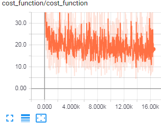
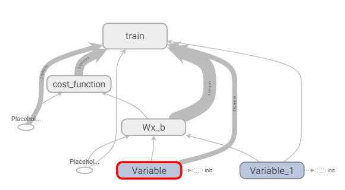
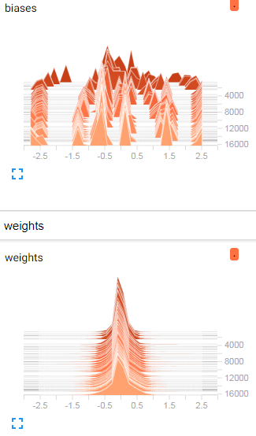

# Handwritten-Digits-Recognition-Engine
## Training classifier to recognize handwritten images using tensorflow

The input_data class download the dataset containing images and labels  and split into training and test set
  
  
Use the tensorboard by writing following line in your terminal
Tensorboard --logdir= <"FileLocation">
Tensorboard will display the defined scalars, graphs, distribution, histogram like the following images  

  

  

  

### Source Inspiration:
#### Siraj Raval
